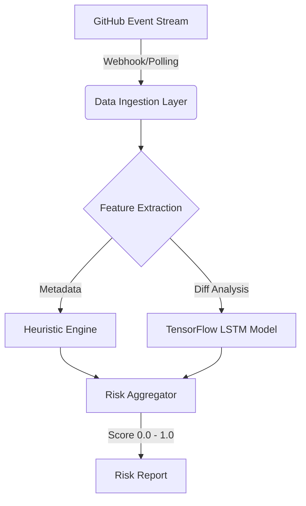

# OSS PR AI: Predictive Triage for High Velocity Repos. Automated risk assessment pipeline for open source maintainers. Reduces time to merge by ~50% by filtering low quality contributions before human review. (This is what it's intended)
`Status: Prototype (Alpha) - Maintained`

OSS PR AI operates as a middleware agent between your repository and your CI/CD pipeline. It utilizes a hybrid evaluation engine combining static heuristic analysis with a TensorFlow LSTM model to predict the merge probability of incoming Pull Requests.

## System Architecture

## Stack
* Python 3.10+
* TensorFlow | Keras
* PyGithub
* Pandas

## Status
* **Current Version:** v0.1.1-alpha (Prototype)
* **License:** MIT
