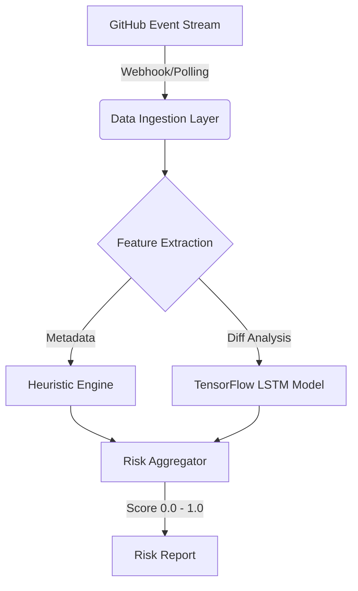

"# OSS PR AI: Automated Pull Request Risk Assessment

## Overview
OSS PR AI is a machine learning driven tool built to measure the fraud risk of open source contributions. It evaluates commit history, contributor reputation, and code patterns to generate a real time risk score (0–1), helping maintainers avoid supply chain threats and low effort spam.

## Key Features
* **Deep Learning Analysis:** Utilizes TensorFlow to detect anomalous patterns in PR diffs.
* **Risk Scoring Engine:** Heuristic + ML hybrid model to evaluate contributor intent.
* **CI/CD Integration:** Designed to run as a GitHub Action.

## System Architecture

## Stack
* Python 3.10+
* TensorFlow / Keras
* PyGithub
* Pandas

## Status
* **Current Version:** v0.1.0-alpha (Prototype)
* **License:** MIT"
